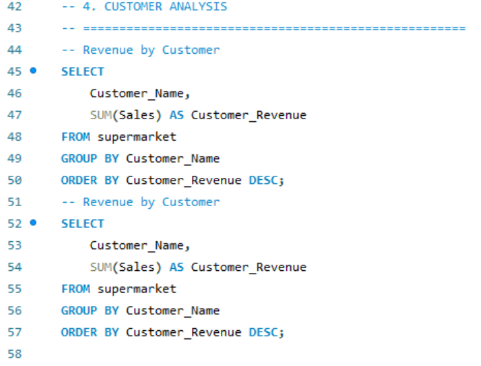
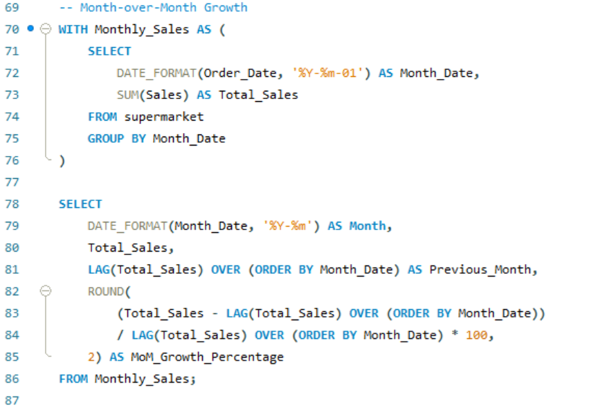

# Sales & Revenue Intelligence Analysis (MySQL)

## Project Overview
This project analyzes sales performance, regional contribution, customer ranking, and revenue growth trends using advanced SQL techniques.

## Key Analysis Performed
- Revenue aggregation using GROUP BY
- Regional contribution percentage using subqueries
- Customer ranking using window functions (RANK)
- Month-over-Month growth using LAG
- Shipping duration analysis using DATEDIFF

## SQL Concepts Used
- Aggregations
- GROUP BY
- Subqueries
- Window Functions
- CTE (WITH statements)
- Date functions

## Key Insights
- Revenue distribution varies significantly across regions.
- Revenue is concentrated among top-performing customers.
- Sales trends fluctuate month-over-month.

## Sample Output

